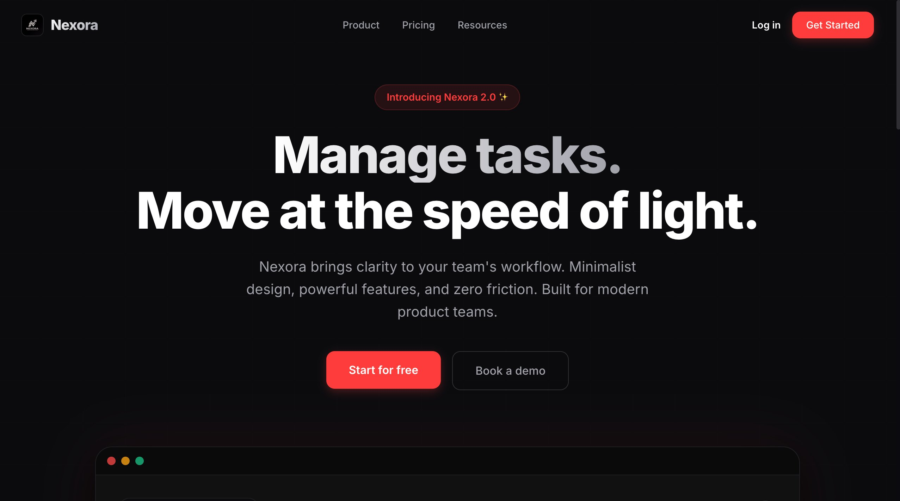
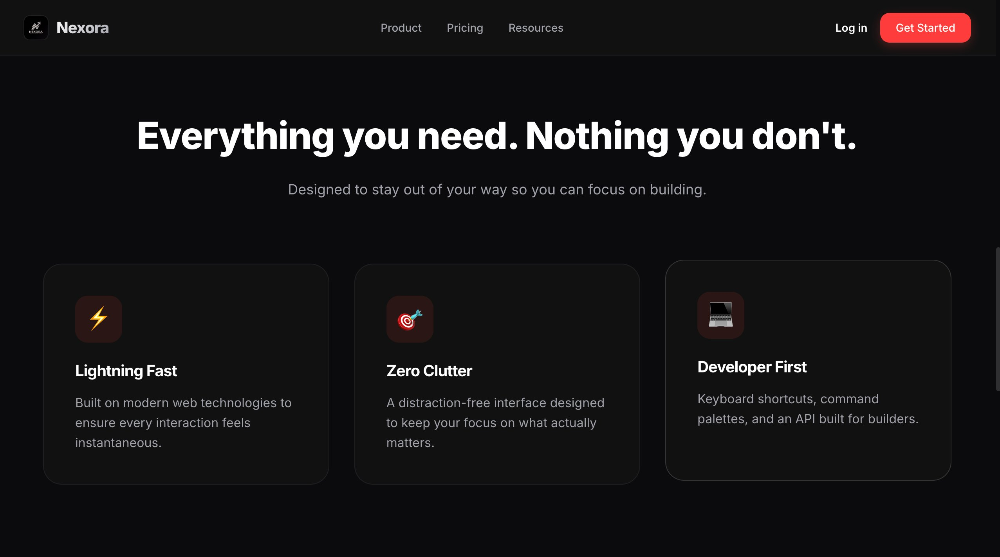
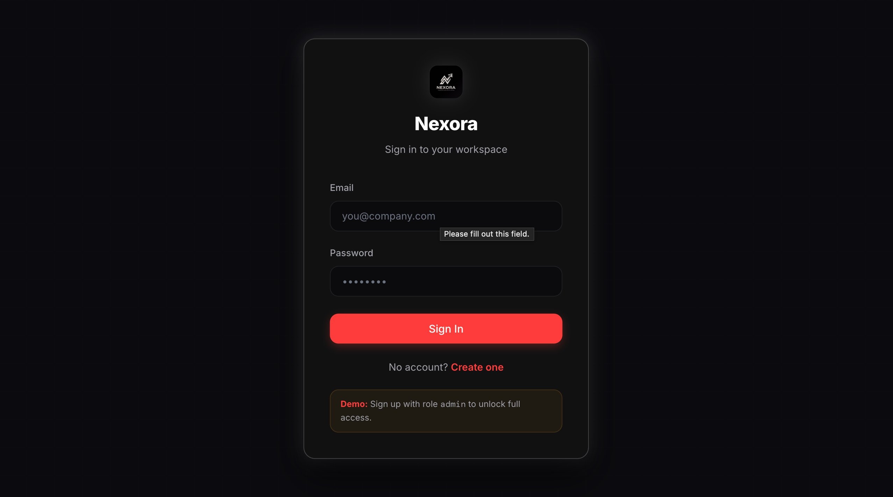
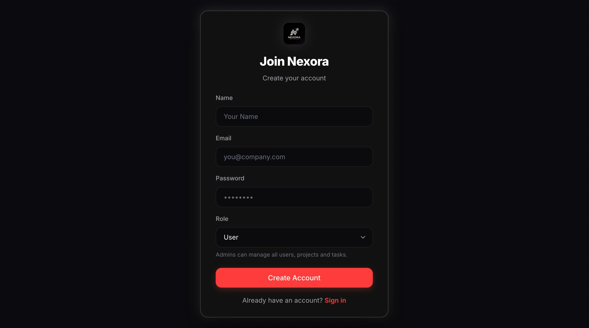
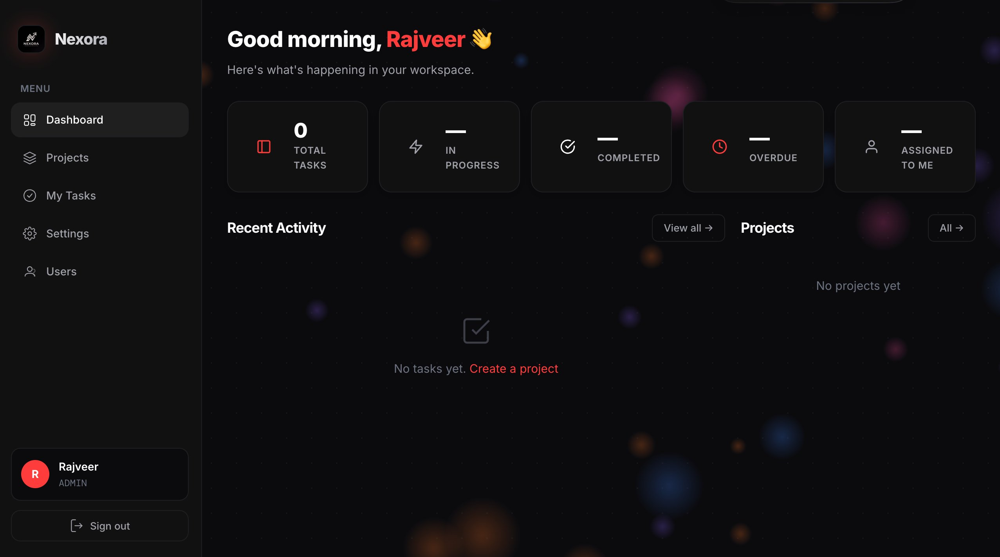
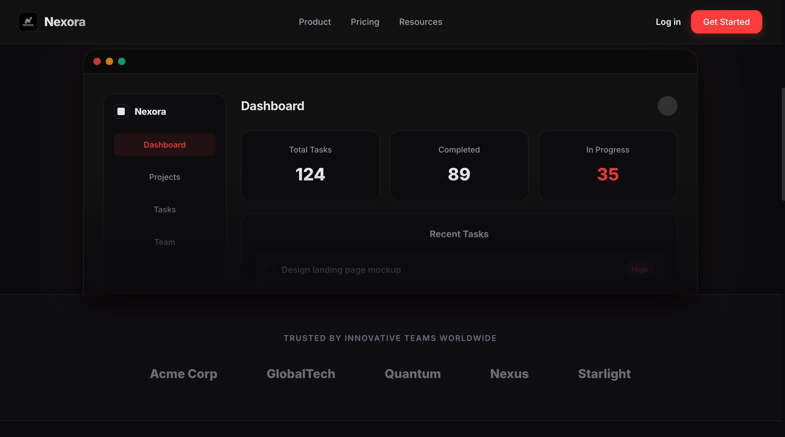
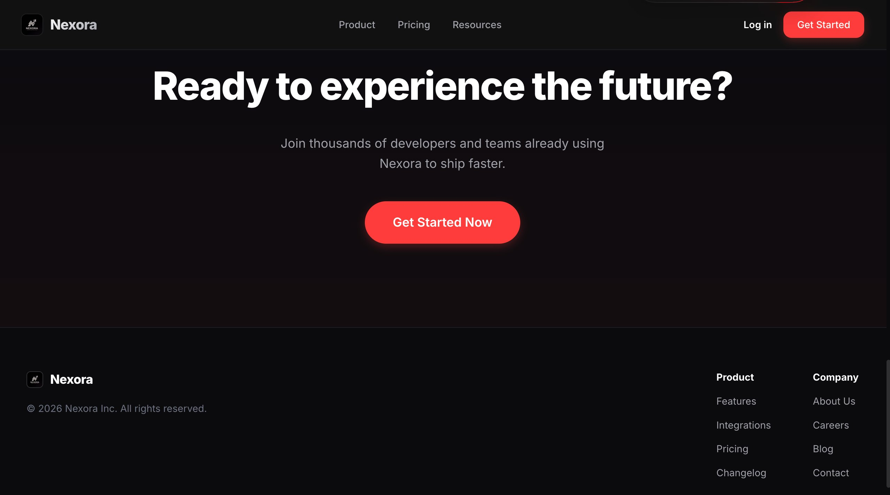

<b></b>🚀 Nexora — Task Manager</b>

  <b>Manage tasks. Move at the speed of light.</b>

  A modern, full-stack <b>team task management platform</b> built for productivity-focused teams. 
  Nexora delivers a <b>minimal, distraction-free UI</b> with powerful collaboration features.

  

📸 Screenshots
🏠 Landing Page

  

✨ Feature Highlights

  

🔐 Authentication

  
  

📊 Dashboard

  

🖥️ App Preview (Landing + Dashboard)

  

🚀 Call to Action

  

✨ Features
🔐 Authentication & Security

JWT-based authentication (7-day expiry)

Password hashing using bcrypt

Protected routes (frontend + backend)

📁 Project Management

Create, edit, delete projects

Assign custom colors

Auto project admin on creation

✅ Task Management

Full CRUD operations

Status: todo, in_progress, done, overdue

Priority: low, medium, high, critical

Assign tasks to team members

Due date tracking

⏰ Smart System

Auto-detect overdue tasks

Real-time dashboard summary

👥 Team Collaboration

Invite users via email

Project-level roles (Admin / Member)

Shared workspace

🛡️ Role-Based Access Control

Global roles: admin, member

Secure API route protection

📊 Dashboard Insights

Total tasks

Completed tasks

In-progress tasks

Overdue tasks

Recent activity tracking

🎨 UI/UX

Dark modern SaaS UI

Smooth animations (Framer Motion)

Interactive particle background

Clean & minimal design

🛠️ Tech Stack
LayerTechnologyFrontendReact 18, React Router v6, ViteBackendNode.js, ExpressDatabaseSQLite (better-sqlite3)AuthJWT (jsonwebtoken), bcryptStylingTailwind CSS + Custom CSSAnimationsFramer MotionDeploymentRailway + Docker

📂 Project Structure
nexora-task-manager/├── assets/│   ├── screenshot-landing.png│   ├── screenshot-features.png│   ├── screenshot-login.png│   ├── screenshot-signup.png│   ├── screenshot-dashboard.png│   ├── screenshot-landing-dashboard-preview.png│   └── screenshot-cta.png│├── backend/├── frontend/├── Dockerfile├── railway.json├── package.json└── README.md

⚙️ Setup & Installation
1️⃣ Clone Repository
git clone https://github.com/your-username/nexora-task-manager.gitcd nexora-task-manager

2️⃣ Backend Setup
cd backendnpm installnode server.js
Runs on:
http://localhost:5001

3️⃣ Frontend Setup
cd frontendnpm installnpm run dev
Runs on:
http://localhost:5173

🔑 Environment Variables
Create .env inside backend/:
PORT=5001JWT_SECRET=your_super_secret_keyDB_PATH=./taskmanager.dbFRONTEND_URL=*
⚠️ Always use a strong JWT_SECRET in production.

🚀 Deployment (Railway)

Push code to GitHub

Go to Railway

Create new project → Link repo

Auto-detect Dockerfile

Add environment variable:
JWT_SECRET=your_secret

Deploy 🚀

Just say 👍
